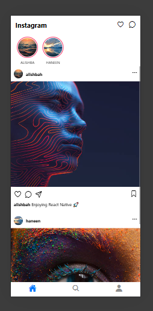
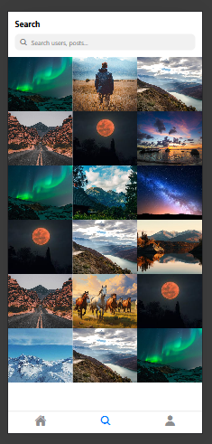
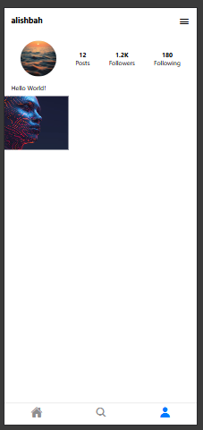

# Instagram Clone - React Native

##  Project Description

A visually appealing Instagram UI clone built with **React Native** and **Expo**. This project replicates the core design and user interface of Instagram, including the home feed, stories, search, and profile screens.

##  Features

- Modern and responsive Instagram-like UI
- Bottom tab navigation
- Stories section with gradient ring effect
- Home feed with posts, captions, and action buttons (like, comment, share, save)
- Search screen with image grid layout
- Profile screen with user stats and bio
- Smooth scrolling experience using FlatList and ScrollView

##  Technologies Used

- **React Native**
- **Expo** (SDK)
- **React Navigation** (Bottom Tab Navigator)
- **@expo/vector-icons** (Ionicons)
- JavaScript (ES6+)

##  Screens Included

1. **Home Screen**
2. **Search Screen**
3. **Profile Screen**

##  App Preview

**Home Screen**  

**Search Screen**  

**Profile Screen**  

